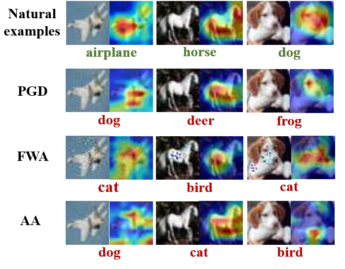

<div align="center">   
  
# Removing Adversarial Noise in Class Activation Feature Space
[](https://openaccess.thecvf.com/content/ICCV2021/papers/Zhou_Removing_Adversarial_Noise_in_Class_Activation_Feature_Space_ICCV_2021_paper.pdf)

</div>


The implementation of [Removing Adversarial Noise in Class Activation Feature Space](https://openaccess.thecvf.com/content/ICCV2021/papers/Zhou_Removing_Adversarial_Noise_in_Class_Activation_Feature_Space_ICCV_2021_paper.pdf) (ICCV 2021)

Deep neural networks (DNNs) are vulnerable to adversarial noise. Pre-processing based defenses could largely remove adversarial noise by processing inputs. However, they are typically affected by the error amplification effect, especially in the front of continuously evolving attacks. To solve this problem, in this paper, we propose to remove adversarial noise by implementing a self-supervised adversarial training mechanism in a class activation feature space. To be specific, we first maximize the disruptions to class activation features of natural examples to craft adversarial examples. Then, we train a denoising model to minimize the distances between the adversarial examples and the natural examples in the class activation feature space.
Empirical evaluations demonstrate that our method could significantly enhance adversarial robustness in comparison to previous state-of-the-art approaches, especially against unseen adversarial attacks and adaptive attacks.


<p float="left" align="center">
 
<figcaption align="center">
A visual illustration of class activation maps of natural examples and adversarial examples. The adversarial examples are crafted by distinct types of non-targeted attacks, e.g., PGD, FWA and AA. Although adversarial noise is imperceptible in pixel level, there exists obvious discrepancies between the class activation maps of natural examples and adversarial examples
</figcaption>
</p>


<p float="left" align="center">
 
<figcaption align="center">
A visual illustration of our defense method CAFD. The proposed defense learns to remove adversarial noise via a self-supervised adversarial training mechanism. We maximally disrupt the class activation features of natural examples to craft adversarial examples and use them to train the denoiser for learning to bring adversarial examples close to natural examples in the class activation feature space.
</figcaption>
</p>


## Requirements
- This codebase is written for `python3` and `pytorch`.
- To install necessary python packages, run `pip install -r requirements.txt`.


## Experiments
### Data && Preparation
- Please download and place all datasets into the 'data' directory. 
- To train a target model

```
Python train_target_model.py 
```

This code provides three model architectures (including VggNet, ResNet and Wide-ResNet). The trained model will be saved in the "checkpoint" folder.


- To generate adversarial training data

-For Training data

```
python example_cam.py
```

We use the "Class Activation Feature based Attack" (CAFD) to generate adversaial samples. The generated samples will be saved in the 'data/training' folder.

-For Test data

```
python example_other.py or python example_autoattack.py
```

We use the "[advertorch](https://github.com/BorealisAI/advertorch)" toolbox to help generate adversairal samples. The first code provides  PGD,  CW, [DDN](https://arxiv.org/abs/1811.09600), [STA](https://openreview.net/forum?id=HyydRMZC-), etc., to generate different adversarial samples. The second code provides [Autoattack](https://arxiv.org/abs/2003.01690).
The generated samples will be saved in the "data/test" folder.


### Training
- To train the CAFD

```
python train_or_test_denoiser.py --mode 0
```

The model parameters of the used target model comes from "checkpoint" folder. The trained defense model will be saved in "checkpoint_denoise" folder.


### Test
- To test CAFD

```
python train_or_test_denoiser.py --mode 1
```

The input data comes from "data/test" folder, and the denoised data is saved in "results/defense" folder. 

- To compute the accuracy rate

```
python test.py
```


## License and Contributing
- This README is formatted based on [paperswithcode](https://github.com/paperswithcode/releasing-research-code).
- Feel free to post issues via Github. 


## Reference
If you find the code useful in your research, please consider citing our paper:


<pre>
@inproceedings{zhou2021removing,
  title={Removing adversarial noise in class activation feature space},
  author={Zhou, Dawei and Wang, Nannan and Peng, Chunlei and Gao, Xinbo and Wang, Xiaoyu and Yu, Jun and Liu, Tongliang},
  booktitle={Proceedings of the IEEE/CVF International Conference on Computer Vision},
  pages={7878--7887},
  year={2021}
}
</pre>
